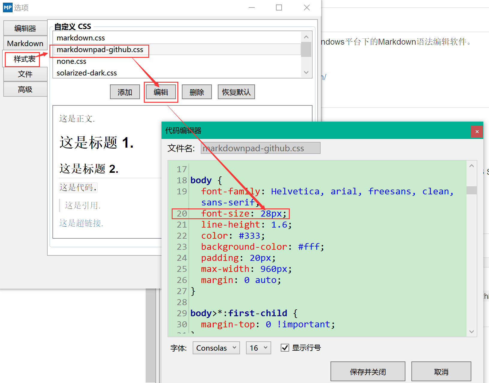

## 简介 ##
MarkdownPad2是一款Windows平台下的Markdown语法编辑软件。
### 官网 ###
[https://markdownpad.com/](https://markdownpad.com/ "官网")
## 安装 ##
### 安装包
[http://markdownpad.com/download/markdownpad2-setup.exe](http://markdownpad.com/download/markdownpad2-setup.exe "安装包")
### Win10上无法预览问题
win10安装后出现无法预览问题，解决办法是安装：Awesomium 1.6.6 SDK
[http://markdownpad.com/download/awesomium_v1.6.6_sdk_win.exe](http://markdownpad.com/download/awesomium_v1.6.6_sdk_win.exe "http://markdownpad.com/download/awesomium_v1.6.6_sdk_win.exe")
  
安装完需要重启。
## 注册码 ##
* 邮箱
  
    Soar360@live.com
* 秘钥
```
GBPduHjWfJU1mZqcPM3BikjYKF6xKhlKIys3i1MU2eJHqWGImDHzWdD6xhMNLGVpbP2M5SN6bnxn2kSE8qHqNY5QaaRxmO3YSMHxlv2EYpjdwLcPwfeTG7kUdnhKE0vVy4RidP6Y2wZ0q74f47fzsZo45JE2hfQBFi2O9Jldjp1mW8HUpTtLA2a5/sQytXJUQl/QKO0jUQY4pa5CCx20sV1ClOTZtAGngSOJtIOFXK599sBr5aIEFyH0K7H4BoNMiiDMnxt1rD8Vb/ikJdhGMMQr0R4B+L3nWU97eaVPTRKfWGDE8/eAgKzpGwrQQoDh+nzX1xoVQ8NAuH+s4UcSeQ==
```
## 设置 ##
### 设置中文菜单
菜单：Tools->Options->Languages 选中中文即可
### 增大预览字体
初始的预览字体较小，可通过
  
菜单：工具->选项->样式表 编辑css文件，修改各个font-size解决

